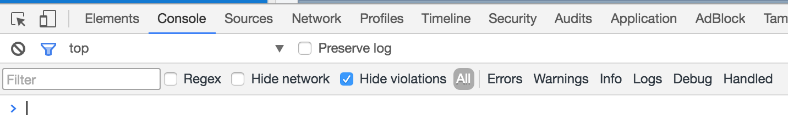
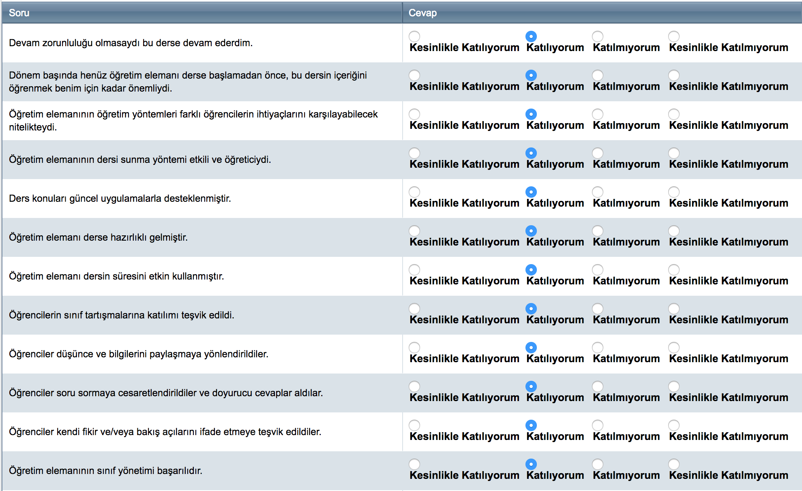
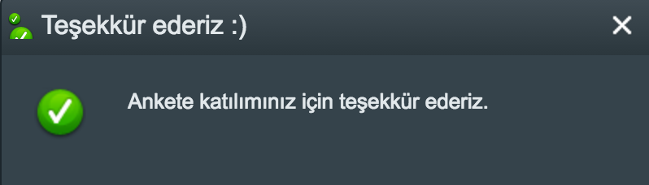

### Pamukkale Üniversitesi - Pusula Değerlendirme Anketi Otomatik Doldurma :pencil:

Merhabalar,

Pamukkale üniversitesi pusula adlı bir öğrenci bilgi sistemine sahip. Pusula, vize ve finaller öncesinde öğrencilere doldurması için her ders için birer değerlendirme anketi doldurmayı zorunlu tutuyor.
Bu gerçekten uzun süren bir işlem ve bunu kısa sürede doldurmamız gereken zamanlar olabiliyor.
Kimi zaman sınava gitmeden önce anket formu ile karşılaşıyoruz ve bu yüzden sınav yerimizi geç öğreniyoruz.

Bu durumu hızlı bir şekilde lehimize çevirebileceğimiz basit bir yöntem var.
Pusula ÖBS'de jQuery mevcut. Bunu tarayıcımızın console'undan kontrol edebiliriz.


* Ctrl+Shift+J (Windows / Linux) veya Cmd+Opt+J (Mac) kısa yolları ile tarayıcı geliştirici panelini açabilirsiniz.
* Hali hazırda açık ise ```console``` butonuna basmalısınız.



Komutlarımızı ```>``` (büyüktür) işareti ile işaretli yere yazacağız.

#### :dart: jQuery'i kontrol etmek için;

``` javascript
> window.$ === $ ? 'jQuery mevcut..' : 'jQuery mevcut değil..'
// jQuery mevcut..
```


#### :dart: Ardından katılıyorum seçmeli butonlarını işaretlettirelim.

```javascript
$('[type="radio"]').each((value, key) => {
  if (value % 4 === 1) {
    $(key).prop("checked", true)
  }
});
```

Bu komutu çalıştırdıktan sonra değerlendirme anketimiz benzer bir görüntüye sahip olacaktır.



#### :dart: Anketi gönder butonuna basarak değerlendirme anketini tamamlayabilirsiniz.

> Dipnot: Kesinlikle katılıyorum'u işaretlemek istiyorsanız,
```javascript
$('[type="radio"]').each((value, key) => {
  if (value % 4 === 1) {
    $(key).prop("checked", true)
  }
});
```
Katılmıyorum'u işaretlemek istiyorsanız,
```javascript
$('[type="radio"]').each((value, key) => {
  if (value % 4 === 2) {
    $(key).prop("checked", true)
  }
});
```
Kesinlikle katılmıyorum'u işaretlemek istiyorsanız,
```javascript
$('[type="radio"]').each((value, key) => {
  if (value % 4 === 3) {
    $(key).prop("checked", true)
  }
});
```
Komutlarını kullanabilirsiniz. :trollface:


